# Entity Relationship Diagram - Incident Management System

This diagram shows the complete data model for the incident management system, including all tables and their relationships.

```mermaid
erDiagram
    USERS {
        uuid id PK
        varchar email UK
        varchar first_name
        varchar last_name
        varchar role
        varchar department
        varchar team
        boolean is_active
        timestamp created_at
        timestamp updated_at
    }

    INCIDENT_CATEGORIES {
        uuid id PK
        varchar name UK
        text description
        uuid parent_category_id FK
        boolean is_active
        timestamp created_at
    }

    IMPACT_LEVELS {
        uuid id PK
        varchar name UK
        text description
        integer severity_score
        integer sla_hours
        boolean is_active
        timestamp created_at
    }

    INCIDENTS {
        uuid id PK
        varchar incident_number UK
        varchar title
        uuid category_id FK
        uuid impact_level_id FK
        varchar priority
        varchar status
        uuid reporter_id FK
        uuid assignee_id FK
        integer affected_customers_count
        decimal estimated_revenue_impact
        uuid customer_id
        varchar order_id
        text resolution_summary
        text root_cause
        varchar resolution_category
        timestamp created_at
        timestamp acknowledged_at
        timestamp first_response_at
        timestamp resolved_at
        timestamp closed_at
        timestamp updated_at
        boolean sla_breach
        timestamp sla_due_at
        varchar source_system
        varchar external_source_id
    }

    INCIDENT_STATUS_HISTORY {
        uuid id PK
        uuid incident_id FK
        varchar previous_status
        varchar new_status
        uuid changed_by_id FK
        text change_reason
        timestamp created_at
    }

    INCIDENT_ASSIGNMENT_HISTORY {
        uuid id PK
        uuid incident_id FK
        uuid previous_assignee_id FK
        uuid new_assignee_id FK
        uuid assigned_by_id FK
        text assignment_reason
        timestamp created_at
    }

    INCIDENT_COMMENTS {
        uuid id PK
        uuid incident_id FK
        uuid author_id FK
        text content
        boolean is_public
        timestamp created_at
        timestamp updated_at
    }

    AFFECTED_SYSTEMS {
        uuid id PK
        varchar name UK
        text description
        varchar system_type
        varchar criticality
        boolean is_active
        timestamp created_at
    }

    INCIDENT_AFFECTED_SYSTEMS {
        uuid id PK
        uuid incident_id FK
        uuid system_id FK
        text impact_description
        timestamp created_at
    }

    INCIDENT_AFFECTED_PRODUCTS {
        uuid id PK
        uuid incident_id FK
        varchar product_sku
        varchar product_name
        integer quantity_affected
        timestamp created_at
    }

    SOLUTION_TEMPLATES {
        uuid id PK
        varchar title
        text description
        text solution_steps
        uuid category_id FK
        text[] tags
        integer usage_count
        decimal effectiveness_rating
        uuid created_by_id FK
        timestamp created_at
        timestamp updated_at
        boolean is_active
    }

    INCIDENT_SOLUTIONS {
        uuid id PK
        uuid incident_id FK
        uuid solution_template_id FK
        boolean was_effective
        text effectiveness_notes
        uuid applied_by_id FK
        timestamp applied_at
    }

    ESCALATION_RULES {
        uuid id PK
        varchar name
        uuid category_id FK
        uuid impact_level_id FK
        varchar priority
        integer time_threshold_hours
        varchar escalate_to_role
        uuid escalate_to_user_id FK
        boolean is_active
        timestamp created_at
    }

    INCIDENT_ESCALATIONS {
        uuid id PK
        uuid incident_id FK
        uuid escalation_rule_id FK
        uuid escalated_from_id FK
        uuid escalated_to_id FK
        text escalation_reason
        timestamp escalated_at
        timestamp resolved_at
    }

    SLA_VIOLATIONS {
        uuid id PK
        uuid incident_id FK
        varchar violation_type
        timestamp expected_time
        timestamp actual_time
        integer violation_minutes
        text business_impact_description
        timestamp created_at
    }

    INCIDENT_METRICS_SNAPSHOT {
        uuid id PK
        uuid incident_id FK
        varchar metric_name
        decimal metric_value
        varchar metric_unit
        timestamp measured_at
        jsonb context
    }

    INCIDENT_ATTACHMENTS {
        uuid id PK
        uuid incident_id FK
        varchar filename
        varchar file_path
        bigint file_size_bytes
        varchar mime_type
        uuid uploaded_by_id FK
        timestamp uploaded_at
        boolean is_public
    }

    %% Relationships
    USERS ||--o{ INCIDENTS : "reports"
    USERS ||--o{ INCIDENTS : "assigned_to"
    USERS ||--o{ INCIDENT_STATUS_HISTORY : "changed_by"
    USERS ||--o{ INCIDENT_ASSIGNMENT_HISTORY : "assigned_by"
    USERS ||--o{ INCIDENT_COMMENTS : "authored_by"
    USERS ||--o{ SOLUTION_TEMPLATES : "created_by"
    USERS ||--o{ INCIDENT_SOLUTIONS : "applied_by"
    USERS ||--o{ ESCALATION_RULES : "escalate_to"
    USERS ||--o{ INCIDENT_ESCALATIONS : "escalated_from"
    USERS ||--o{ INCIDENT_ESCALATIONS : "escalated_to"
    USERS ||--o{ INCIDENT_ATTACHMENTS : "uploaded_by"

    INCIDENT_CATEGORIES ||--o{ INCIDENTS : "categorizes"
    INCIDENT_CATEGORIES ||--o{ INCIDENT_CATEGORIES : "parent_child"
    INCIDENT_CATEGORIES ||--o{ SOLUTION_TEMPLATES : "categorizes"
    INCIDENT_CATEGORIES ||--o{ ESCALATION_RULES : "applies_to"

    IMPACT_LEVELS ||--o{ INCIDENTS : "defines_impact"
    IMPACT_LEVELS ||--o{ ESCALATION_RULES : "applies_to"

    INCIDENTS ||--o{ INCIDENT_STATUS_HISTORY : "has_history"
    INCIDENTS ||--o{ INCIDENT_ASSIGNMENT_HISTORY : "has_assignments"
    INCIDENTS ||--o{ INCIDENT_COMMENTS : "has_comments"
    INCIDENTS ||--o{ INCIDENT_AFFECTED_SYSTEMS : "affects"
    INCIDENTS ||--o{ INCIDENT_AFFECTED_PRODUCTS : "affects"
    INCIDENTS ||--o{ INCIDENT_SOLUTIONS : "uses"
    INCIDENTS ||--o{ INCIDENT_ESCALATIONS : "escalated"
    INCIDENTS ||--o{ SLA_VIOLATIONS : "violates"
    INCIDENTS ||--o{ INCIDENT_METRICS_SNAPSHOT : "measured"
    INCIDENTS ||--o{ INCIDENT_ATTACHMENTS : "has_attachments"

    AFFECTED_SYSTEMS ||--o{ INCIDENT_AFFECTED_SYSTEMS : "involved_in"

    SOLUTION_TEMPLATES ||--o{ INCIDENT_SOLUTIONS : "applied_as"

    ESCALATION_RULES ||--o{ INCIDENT_ESCALATIONS : "triggered"
```

## Key Relationships Explained

### Core Entity Relationships
- **USERS** - Central to the system, can be reporters, assignees, or perform actions
- **INCIDENTS** - The main entity that connects to most other tables
- **INCIDENT_CATEGORIES** - Hierarchical structure allowing parent-child relationships
- **IMPACT_LEVELS** - Defines business impact and SLA expectations

### Historical Tracking
- **INCIDENT_STATUS_HISTORY** - Tracks every status change for complete audit trail
- **INCIDENT_ASSIGNMENT_HISTORY** - Records all reassignments with reasons
- **INCIDENT_COMMENTS** - Communication log throughout incident lifecycle

### Business Context
- **INCIDENT_AFFECTED_SYSTEMS** - Many-to-many relationship between incidents and systems
- **INCIDENT_AFFECTED_PRODUCTS** - Links incidents to specific products for impact analysis
- **SLA_VIOLATIONS** - Detailed tracking of SLA breaches with business impact

### Knowledge Management
- **SOLUTION_TEMPLATES** - Reusable procedures categorized by incident type
- **INCIDENT_SOLUTIONS** - Tracks which solutions were applied and their effectiveness

### Escalation Management
- **ESCALATION_RULES** - Defines automatic escalation criteria
- **INCIDENT_ESCALATIONS** - Records all escalations with timing and reasons

### Analytics Support
- **INCIDENT_METRICS_SNAPSHOT** - Point-in-time metrics for trending analysis
- **INCIDENT_ATTACHMENTS** - Supporting documentation and evidence

## Diagram Legend
- **PK**: Primary Key
- **FK**: Foreign Key  
- **UK**: Unique Key
- **||--o{**: One-to-many relationship
- **||--||**: One-to-one relationship
- **}o--o{**: Many-to-many relationship

This ERD provides the complete picture of how all data entities relate to each other in the incident management system, enabling comprehensive tracking, reporting, and analytics capabilities.
